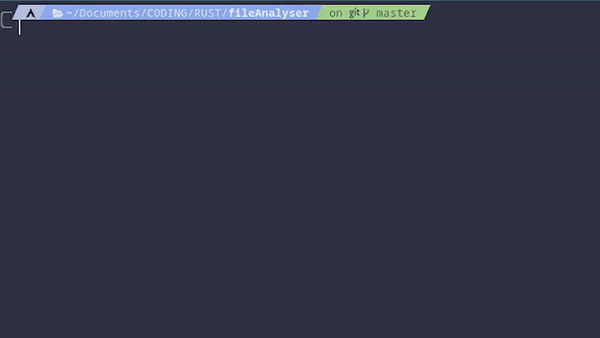

#  Flyser

A simple file analyser with rust.

By Aria Fibla



## Installation

```
cargo install --git https://github.com/lxbx44/flyser.git
```

## Usage


```
flyser [file name]
```

or

```
flyser [path to file name]
```

For example: `flyser src/main.rs`

## Manual Instalation

- Download the files from the [releases](https://github.com/lxbx44/flyser/releases/tag/src) tab or from the `app/` directory.
